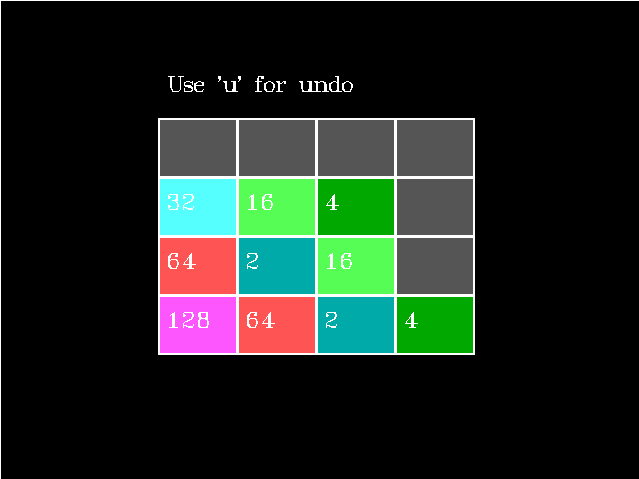

# 2048: 

  

##setup
* Download and Install Turbo C++ if not already installed.
* Open the project and edit line number 131 of 2048.cpp  
    &nbsp; &nbsp; &nbsp; &nbsp; initgraph(&gd,&gm,"c:/turboc3/bgi");  
    &nbsp; &nbsp; &nbsp; &nbsp; replace "c:/turboc3/bgi" by the absolute path of bgi  
* Save and Press ctrl+F9 to run the game.
* Use Arrow keys to move and 'u' for undo.
